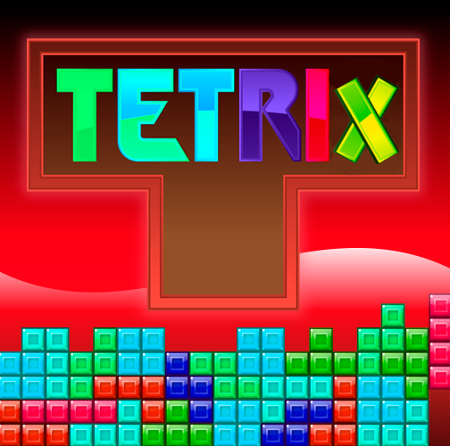
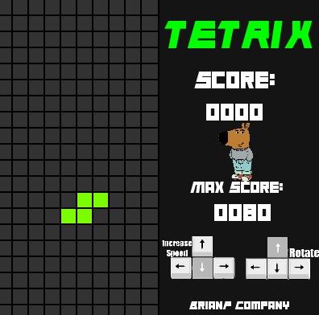

# Tetrix

Bienvenido a **Tetrix**, un emocionante juego inspirado en el clásico Tetris desarrollado en C++ usando la biblioteca **SFML**.

## Descripción

Tetrix es una reinvención moderna del clásico juego de bloques, con gráficos dinámicos, sonidos envolventes y una interfaz visualmente atractiva. Experimenta la emoción de completar líneas mientras compites para superar tu propio puntaje máximo.

## Características principales

### 1. **Interfaz de usuario (IU)**
La clase `IU` administra la presentación visual del juego:
- Muestra el puntaje actual y el puntaje máximo.
- Cambia dinámicamente el color del título "TETRIX".
- Incluye mensajes como "Game Over" y "New Score".
- Utiliza una fuente personalizada (`Animal.otf`).

### 2. **Tablero**
La clase `TetrisTablero` administra el funcionamiento interno del juego:
- Controla la posición, movimientos y rotaciones de las piezas.
- Detecta y limpia líneas completadas.
- Cambia dinámicamente los colores de las piezas y el tablero.

### 3. **Piezas Tetris**
La clase `TetrisPartes` contiene las formas y transformaciones de las piezas:
- Maneja varias formas clásicas como cuadrado, línea, Z, S, L, J y T.
- Implementa rotaciones precisas para cada pieza.

### 4. **Sonidos**
La clase `Sonido` administra los efectos sonoros y la música:
- Música de fondo (`MusicaFondo.ogg`).
- Efectos de sonido para eventos como completar líneas (`NuevaLinea.ogg`), nuevo puntaje máximo y fin de juego (`ChillGuy.ogg`).

### 5. **Sprites**
- **ChillGuy:** Un personaje para motivarte!
- **Rotate y Speed:** Indicadores visuales para mejorar la experiencia del jugador.

## **Ejecucion** 
Ejecuta el proyecto directamente de la carpeta **bin** y escribe en la terminal de bash:
- **make run**
o manualmente usando: 
- **/bin/Game**

## Requisitos

### **Biblioteca**
- **SFML**  versión 2.5.1 o superior.

### **Archivos necesarios**
Asegúrate de que los siguientes archivos estén en las rutas correctas:
- Carpeta `data/`:
  - `Animal.otf` (Fuente)
  - `ChillGuyP.png`, `rotate.png`, `Speed.png` (Sprites)
  - `MusicaFondo.ogg`, `NuevaLinea.ogg`, `ChillGuy.ogg` (Sonidos)
  - `MaxPuntaje.txt` (Archivo para almacenar puntajes)

## Organización del proyecto
###TETRIS/  
├── bin/  
│   ├── Game.exe                  
├── data/                
│   ├── Animal.otf  
│   ├── ChillGuyP.png  
│   ├── MusicaFondo.ogg  
│   ├── NuevaLinea.ogg  
│   ├── MaxPuntaje.txt  
├── docs/      
│   ├── README.md              
├── include/               
│   ├── IU.hpp  
│   ├── Sonido.hpp  
│   ├── TetrisPartes.hpp  
│   ├── TetrisTablero.hpp  
├── src/                   
│   ├── Main.cpp  
│   ├── IU.cpp  
│   ├── Sonido.cpp  
│   ├── TetrisPartes.cpp  
│   ├── TetrisTablero.cpp  
└── Makefile             