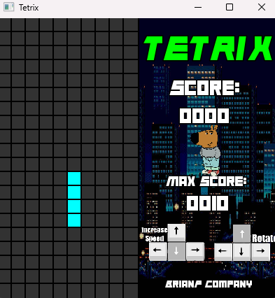
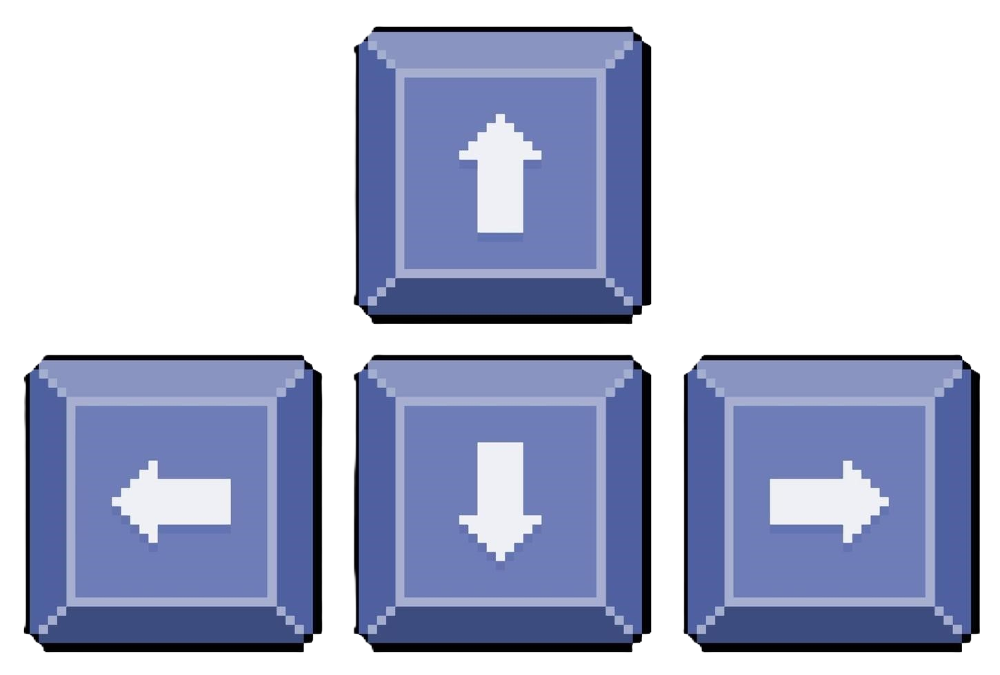
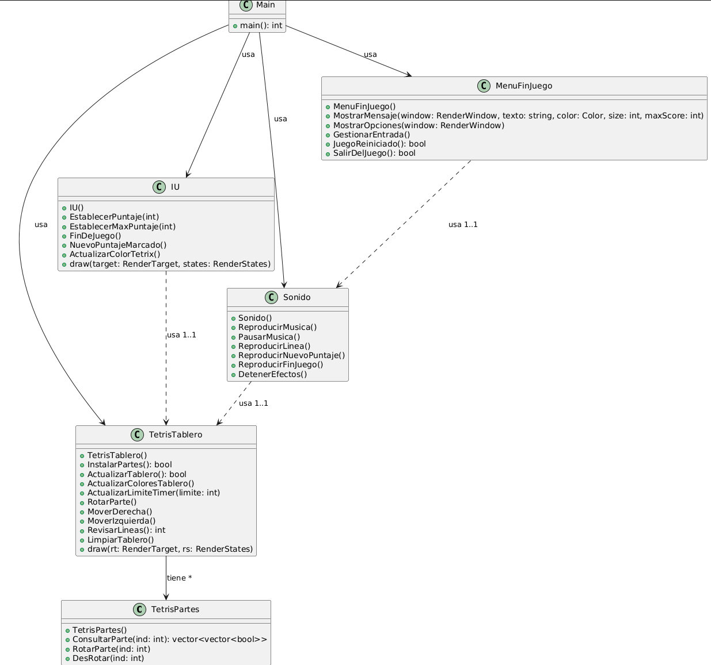

# Tetrix

Welcome to **Tetrix**, an exciting game inspired by the classic Tetris, developed in C++ using the **SFML** library.

## Description

Tetrix is a modern reinvention of the classic block game, featuring dynamic graphics, immersive sounds, and a visually appealing interface. Experience the thrill of completing lines while striving to beat your own high score.

## Author  
- Brian Prado  

## Key Features

### 1. **User Interface (UI)**
The `IU` class manages the visual presentation of the game:
- Displays the current score and the high score.
- Dynamically changes the color of the "TETRIX" title.
- Includes messages such as "Game Over" and "New Score."
- Utilizes a custom font (`Animal.otf`).

### 2. **Game Board**
The `TetrisTablero` class handles the game's internal functionality:
- Controls the position, movements, and rotations of the pieces.
- Detects and clears completed lines.
- Dynamically changes the colors of the pieces and the board.

### 3. **Tetris Pieces**
The `TetrisPartes` class contains the shapes and transformations of the pieces:
- Manages various classic shapes like square, line, Z, S, L, J, and T.
- Implements precise rotations for each piece.

### 4. **Sounds**
The `Sonido` class manages sound effects and music:
- Background music (`MusicaFondo.ogg`).
- Sound effects for events like clearing lines (`NuevaLinea.ogg`), achieving a new high score, and game over (`ChillGuy.ogg`).

### 5. **Sprites**
- **ChillGuy:** A character to keep you motivated!
- **Rotate and Speed:** Visual indicators to enhance the player experience.

## **Execution** 
Run the project directly from the **bin** folder and type the following in the bash terminal:
- **make run**  
or manually using:   
- **/bin/Game**  

  

## Controls    
- Right and Left Arrow -> Move the piece right or left    
- Up Arrow -> Rotate the piece    
- Down Arrow -> Increases drop speed    

- Left Shift -> Restart when you lose    
  
- Space -> Close the window (Exit)  
  

## Requirements

### **Library**
- **SFML** version 2.5.1 or higher.

### **Necessary Files**
Ensure the following files are in their correct locations:
- `data/` folder:
  - `Animal.otf` (Font)
  - `ChillGuyP.png`, `rotate.png`, `Speed.png` (Sprites)
  - `MusicaFondo.ogg`, `NuevaLinea.ogg`, `ChillGuy.ogg` (Sounds)
  - `MaxPuntaje.txt` (File to store scores)

## Project Organization
### TETRIS/   
├── bin/    
│   ├── Game.exe                    
├── data/                  
│   ├── Animal.otf    
│   ├── ChillGuyP.png    
│   ├── MusicaFondo.ogg    
│   ├── NuevaLinea.ogg    
│   ├── MaxPuntaje.txt    
├── docs/        
│   ├── README.md                
├── include/                 
│   ├── IU.hpp    
│   ├── Sonido.hpp    
│   ├── TetrisPartes.hpp    
│   ├── TetrisTablero.hpp   
│   ├── MenuFinJuego.hpp      
├── src/                     
│   ├── Main.cpp    
│   ├── IU.cpp    
│   ├── Sonido.cpp    
│   ├── TetrisPartes.cpp    
│   ├── TetrisTablero.cpp  
│   ├── MenuFinJuego.cpp      
└── Makefile  
## UML Diagram
  